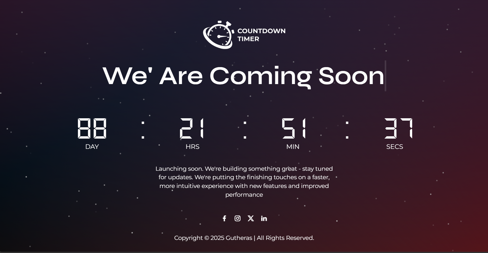

# 🚀 Coming Soon Landing Page

A sleek, modern and fully responsive **Coming Soon** landing page built using **HTML**, **CSS** and **JavaScript**. Ideal for businesses, startups or personal portfolios to display while your full website is under development.

> This landing page includes a countdown timer and social media integration - giving visitors a way to stay connected even before your full site is live.

 

---

## ✨ Features

- ⚡ **Modern Design** — Clean, professional and minimalist layout.
- ⏳ **Countdown Timer** — Displays time left until launch.
- 📱 **Fully Responsive** — Looks great on all devices (mobile, tablet, desktop).
- 🔗 **Social Media Links** — Add icons and links to your social accounts.
- 💬 **Easy to Customize** — Modify text, colors, fonts and layout in minutes.

---
## 📁 Project Structure

coming-soon/
├── assets/
│   ├── css/                  # All stylesheet files
│   ├── images/               # All image assets
│       ├── favicon/          # Favicon
│       ├── logo.png          # The site logo
│       └── preview.png       # Screenshot I used in my README
│   └── js/                   # Countdown and other JavaScript files
├── index.html                # Main landing page file
└── README.md                 # Project documentation


---

## 🚀 Getting Started

Follow these steps to clone, run and customize your Coming Soon page:

### 1. Clone the Repository

Use Git to download the project to your local machine:

```bash
git clone https://github.com/Gutheras/coming-soon
cd coming-soon
```
💡 This creates a local copy of the project on your machine so you can view and edit it.

### 2. Download as ZIP (Alternative)

If you're not familiar with Git, you can download the project manually:

Go to the repository: https://github.com/Gutheras/coming-soon

Click the green <> Code button

Choose Download ZIP

Extract the ZIP file to a folder on your computer

Open the folder in your file explorer or code editor

### 3. Open the Project in Your Browser

After cloning or extracting the project, open the landing page in your browser.

📁 Option A: Use your system’s command line

Run one of the following commands based on your operating system:

Windows
```bash
start index.html
```

macOS
```bash
open index.html
```

📁 Option B: Manual

Navigate to the project folder and double-click index.html to open it in your default browser.

### 4. Use Live Server (Recommended for Development)

To get real-time updates as you make changes:

Open the project in Visual Studio Code

Install the Live Server extension (if not already installed)

Right-click index.html → Click “Open with Live Server”

💡 This allows you to see changes instantly in your browser without manually refreshing.

### 5. Start Customizing

Once everything is running:

✏️ Modify styles in assets/css/

🖼️ Update images in assets/images/

🧱 Edit layout and content in index.html

🔧 This project is built with simplicity in mind - just open and edit!


